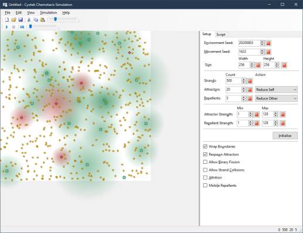

# Simulating Bacterial Chemotaxis

This repository contains a sample application attempting to
simulate **Chemotaxis**,  the movement of an organism either
toward or away from chemicals, depending on if the detected
chemical is positive (a food source) or negative (a poison).

For more information, please see the following article on the
Cyotek blog:

* [Simulating Bacterial Chemotaxis](https://www.cyotek.com/blog/simulating-bacterial-chemotaxis)
